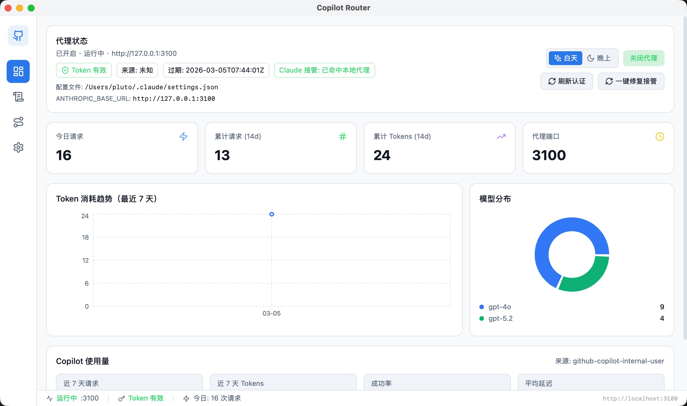
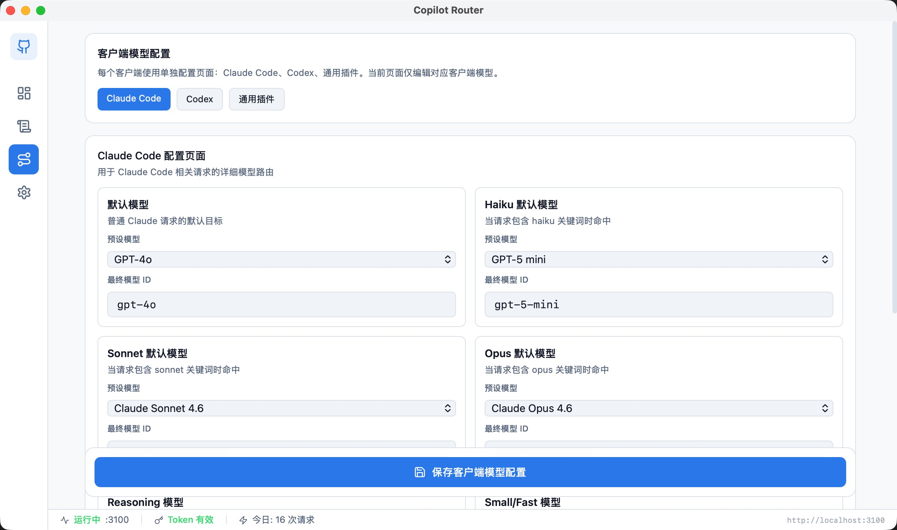

# 🚦 Copilot Router

一个基于 **Tauri + Rust + React** 的本地 AI 路由器。  
目标是把 **Claude Code / Codex / 其他兼容客户端** 统一接到 GitHub Copilot 能力，并提供可视化控制台。

## ✨ 功能亮点

- 🔐 GitHub Device Flow 登录 + Token 刷新
- 🌐 本地代理转发：`/v1/chat/completions`、`/v1/messages`、`/v1/models`
- 🧠 按客户端独立模型配置（Claude Code / Codex / 通用）
- 🧩 细粒度模型位（如 Claude 的 Haiku/Sonnet/Opus/Reasoning/Fast）
- 🛠️ Claude 接管状态检测与一键修复（`~/.claude/settings.json`）
- 📊 Dashboard 统计：请求量、Token 消耗、模型分布、日志
- 🌗 主题切换：白天 / 晚上

## 🧱 技术栈

- Frontend: React + TypeScript + Vite + Tailwind CSS + React Query + Recharts
- Backend: Tauri 2 + Rust + Axum + Reqwest + SQLx (SQLite)

## 📥 下载安装

前往 [GitHub Releases](https://github.com/pluto037/copilot-router/releases/latest) 下载对应平台的安装包：

| 平台 | 文件 | 说明 |
|------|------|------|
| macOS (Apple Silicon) | `*.aarch64.dmg` | M1/M2/M3 芯片 Mac |
| macOS (Intel) | `*.x64.dmg` | Intel 芯片 Mac |
| Linux | `*.AppImage` / `*.deb` | Linux 发行版 |
| Windows | `*.msi` / `*.exe` | Windows 10/11 |

[](https://github.com/pluto037/copilot-router/releases/latest)

## 🚀 快速开始

### 1) 环境要求

- Node.js 18+
- Rust stable
- Tauri 2 构建依赖（请按官方文档安装）

### 2) 安装依赖

```bash
npm install
```

### 3) 启动开发

```bash
npm run tauri:dev
```

### 4) 构建检查

```bash
npm run build
cargo check --manifest-path src-tauri/Cargo.toml
```

## 🔌 客户端接入说明

本地代理默认地址：

- Base URL: `http://127.0.0.1:3100/v1`
- API Key: `copilot-router`（大多数 SDK 会校验非空）

## 🧭 模型配置页面

模型页已按客户端拆分：

- `#/mappings/claude` → Claude Code
- `#/mappings/codex` → Codex
- `#/mappings/generic` → 通用插件

每页单独保存对应客户端的模型配置，更直观。

## 🖼️ 界面预览

> 可将截图放到 `docs/screenshots/` 目录并替换下面链接。

### Dashboard



### Model Mappings



## 🛡️ Claude 接管

应用会读写并校验：`~/.claude/settings.json`

关键字段包括：

- `ANTHROPIC_BASE_URL`
- `ANTHROPIC_API_KEY`
- `ANTHROPIC_AUTH_TOKEN`
- `ANTHROPIC_MODEL` / `ANTHROPIC_DEFAULT_*_MODEL`

当 Dashboard 显示“未命中本地代理”时，可点击「一键修复接管」。

## 📁 项目结构

```text
src/            # React 前端
src-tauri/      # Rust 后端与 Tauri 配置
```

## 📦 发布流程

项目已配置 GitHub Actions 自动化发布流水线（`.github/workflows/release.yml`），支持 macOS、Linux、Windows 三平台构建。

### ⚡ 一键发版（推荐）

```bash
# 1) 本地准备发布（自动同步版本号 + build/check + commit + tag）
npm run release:prepare -- v1.0.0

# 2) 推送代码与标签，触发 GitHub Release
git push && git push origin v1.0.0
```

也可以直接一步到位：

```bash
npm run release:prepare -- v1.0.0 --push
```

> 脚本会自动更新这 3 个版本号：`package.json`、`src-tauri/tauri.conf.json`、`src-tauri/Cargo.toml`

### 发布新版本

1. 🔎 发布前检查仓库中是否包含真实 Token/密钥。
2. ✅ 本地执行 `npm run build` + `cargo check` 验证构建。
3. 🏷️ 推送版本标签触发自动构建与发布：
   ```bash
   git tag v1.0.0
   git push origin v1.0.0
   ```
4. GitHub Actions 将自动在 Windows / macOS / Linux 上构建，并创建 GitHub Release。
5. 📝 在 Release Notes 说明支持客户端与已知限制。

也可在 GitHub Actions 页面手动触发 `Release` 工作流并指定版本号。

### 🧯 如果 Release 里只有 Source code

这通常表示构建任务失败或资产上传阶段未成功。

可按以下顺序处理：

1. 到 GitHub Actions 查看 `Release` 工作流日志，确认失败平台。
2. 在仓库 Settings → Actions → General，确认 **Workflow permissions** 为 **Read and write**。
3. 修复后重新运行该工作流（或重新推送新 tag，例如 `v1.0.1`）。

> 建议优先发布新 patch 版本（如 `v1.0.1`），避免重复使用同一 tag 带来的缓存与资产覆盖问题。

## 🗺️ Roadmap

- [ ] 更细粒度的客户端识别（基于请求特征而非仅模型名）
- [ ] 模型路由规则可视化调试（命中路径追踪）
- [ ] 导入/导出配置（含模板预设）
- [ ] 更多可观测指标（错误类型分布、耗时分位）
- [ ] 可选的自动更新与版本迁移提示

## ❓FAQ

### URL 填了还要填 Key 吗？

建议要填。很多 SDK/插件要求 Key 非空，统一填：`copilot-router`。

### 为什么代理开启后仍然失败？

优先检查：

- Token 是否有效
- 代理开关是否已开启
- Base URL 是否指向本地 `/v1`
- Claude 接管是否命中本地代理

### 为什么显示模型和最终请求模型不同？

这是预期行为。系统支持“展示名”与“实际请求 model id”分离，便于多客户端兼容。

## 📄 License

MIT
